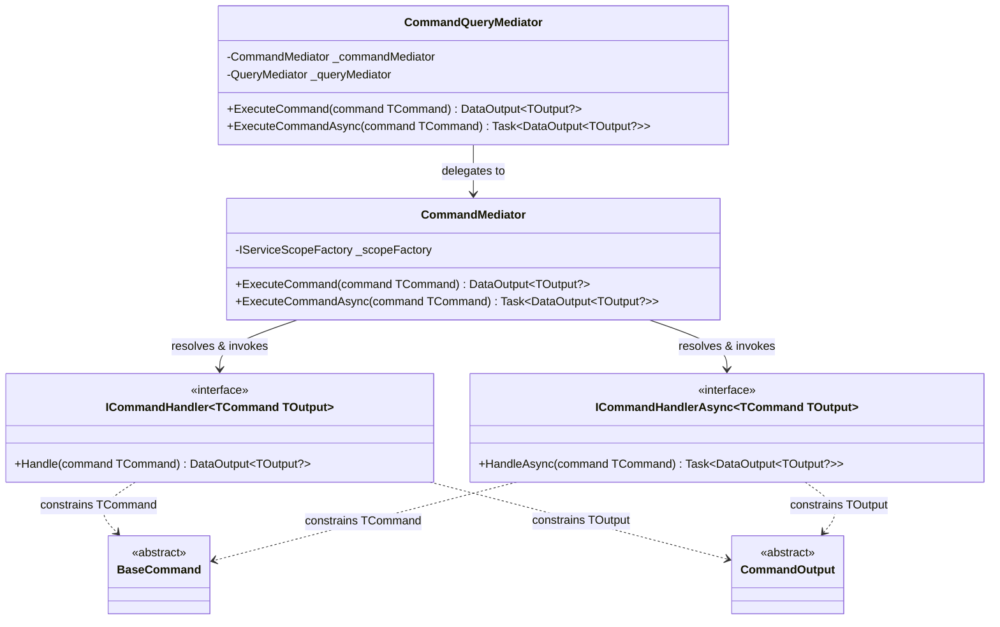
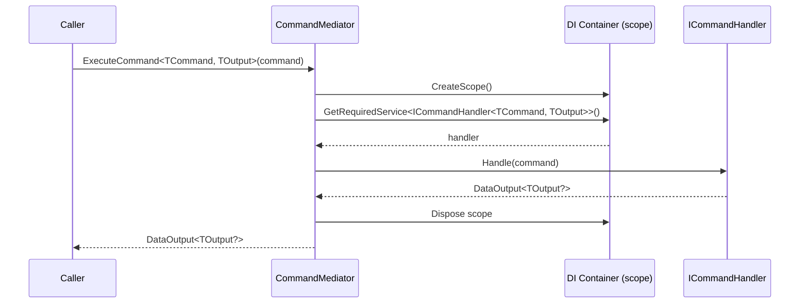
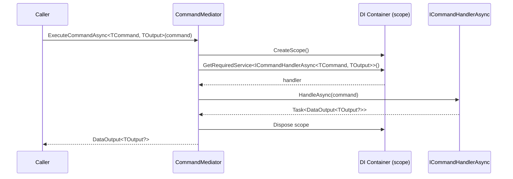

+++
title = "Command Architecture"
show_nav       = true
nav_back_label = "Home"
nav_back_url   = "/dotnet-mediator"
nav_next_label = "Query Architecture"
nav_next_url   = "/dotnet-mediator/query-architecture"
+++

Commands represent **write intents** — creating, updating, or deleting state. The command side of `ArturRios.Mediator` enforces a strict one-command-one-handler rule and isolates each execution in its own DI scope.

## Core Types

| Type | Purpose |
|---|---|
| `BaseCommand` | Abstract base class for all command data carriers |
| `CommandOutput` | Abstract base class for the result payload |
| `ICommandHandler<TCommand, TOutput>` | Synchronous handler contract |
| `ICommandHandlerAsync<TCommand, TOutput>` | Asynchronous handler contract |
| `CommandMediator` | Resolves and invokes the registered handler |

### BaseCommand

```csharp
public abstract class BaseCommand;
```

Derive from `BaseCommand` to create a command. Expose the data the handler needs as plain properties. Commands are simple data carriers — no business logic belongs here.

### CommandOutput

```csharp
public abstract class CommandOutput;
```

Derive from `CommandOutput` to describe the result of a command (for example, the identifier of the newly created entity). The mediator wraps it in `DataOutput<TOutput?>` before returning it to the caller.

### ICommandHandler

```csharp
public interface ICommandHandler<in TCommand, TOutput>
    where TCommand : BaseCommand
    where TOutput  : CommandOutput
{
    DataOutput<TOutput?> Handle(TCommand command);
}
```

Implement for synchronous execution. Register **one** implementation per `<TCommand, TOutput>` pair in the DI container.

### ICommandHandlerAsync

```csharp
public interface ICommandHandlerAsync<in TCommand, TOutput>
    where TCommand : BaseCommand
    where TOutput  : CommandOutput
{
    Task<DataOutput<TOutput?>> HandleAsync(TCommand command);
}
```

Implement for asynchronous execution. Register **one** implementation per `<TCommand, TOutput>` pair in the DI container.

### CommandMediator

```csharp
public class CommandMediator(IServiceScopeFactory scopeFactory)
{
    public DataOutput<TOutput?>       ExecuteCommand     <TCommand, TOutput>(TCommand command) ...
    public Task<DataOutput<TOutput?>> ExecuteCommandAsync<TCommand, TOutput>(TCommand command) ...
}
```

For each call the mediator creates a new DI scope, resolves the matching handler, invokes it, and disposes the scope. This ensures scoped dependencies (e.g. `DbContext`) are isolated per command execution.

---

## Class Diagram



---

## Sequence Diagrams

### Synchronous Command Execution



### Asynchronous Command Execution



---

## Usage Example

### Define the command and output

```csharp
public class CreateProductCommand : BaseCommand
{
    public string Name  { get; set; } = string.Empty;
    public decimal Price { get; set; }
}

public class CreateProductOutput : CommandOutput
{
    public Guid Id { get; set; }
}
```

### Implement the handler

```csharp
public class CreateProductHandler : ICommandHandlerAsync<CreateProductCommand, CreateProductOutput>
{
    private readonly IProductRepository _repository;

    public CreateProductHandler(IProductRepository repository) => _repository = repository;

    public async Task<DataOutput<CreateProductOutput?>> HandleAsync(CreateProductCommand command)
    {
        var id = await _repository.InsertAsync(command.Name, command.Price);
        return DataOutput<CreateProductOutput?>.Success(new CreateProductOutput { Id = id });
    }
}
```

### Register in DI

```csharp
builder.Services.AddSingleton<CommandMediator>();
builder.Services.AddScoped<ICommandHandlerAsync<CreateProductCommand, CreateProductOutput>, CreateProductHandler>();
```

### Dispatch

```csharp
var result = await mediator.ExecuteCommandAsync<CreateProductCommand, CreateProductOutput>(
    new CreateProductCommand { Name = "Widget", Price = 9.99m });

if (result.IsSuccess)
    Console.WriteLine($"Created: {result.Data!.Id}");
```

---
