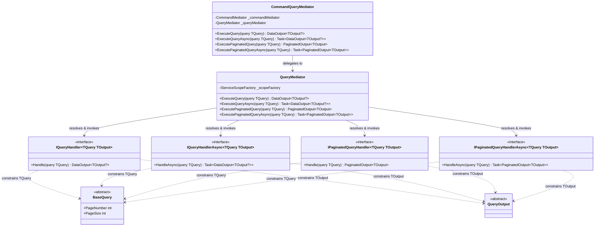
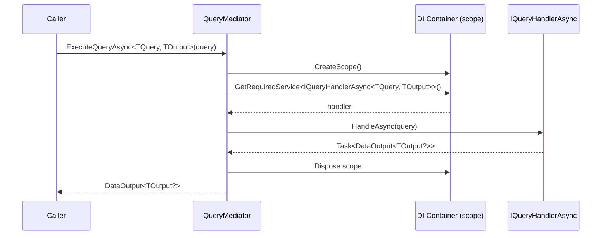
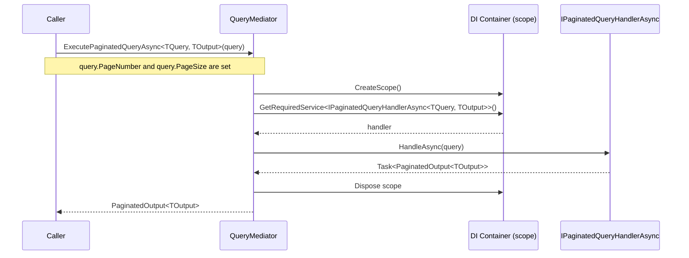
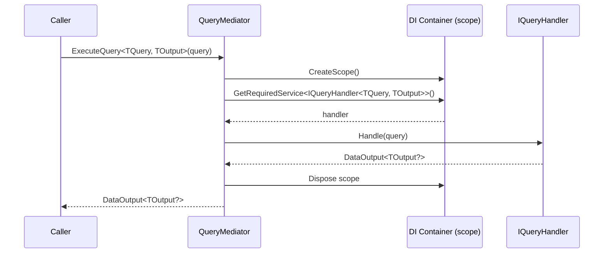

+++
title = ""
show_nav       = true
nav_back_label = "Home"
nav_back_url   = "/dotnet-mediator"
nav_next_label = "Command Architecture"
nav_next_url   = "/dotnet-mediator/command-architecture"
+++

# Query Architecture

Queries represent **read-only requests** for data. The query side of `ArturRios.Mediator` supports two result shapes: a single `DataOutput<T>` for item lookups and a `PaginatedOutput<T>` for collection queries that need page metadata.

## Core Types

| Type | Purpose |
|---|---|
| `BaseQuery` | Abstract base class for all query data carriers |
| `QueryOutput` | Abstract base class for the result payload |
| `IQueryHandler<TQuery, TOutput>` | Synchronous single-result handler contract |
| `IQueryHandlerAsync<TQuery, TOutput>` | Asynchronous single-result handler contract |
| `IPaginatedQueryHandler<TQuery, TOutput>` | Synchronous paginated handler contract |
| `IPaginatedQueryHandlerAsync<TQuery, TOutput>` | Asynchronous paginated handler contract |
| `QueryMediator` | Resolves and invokes the registered handler |

### BaseQuery

```csharp
public abstract class BaseQuery
{
    public int PageNumber { get; set; } = 1;   // 1-based
    public int PageSize   { get; set; } = 100;
}
```

Derive from `BaseQuery` to create a query. Expose filter criteria as plain properties. The `PageNumber` and `PageSize` properties are consumed by paginated handlers and ignored by single-result ones.

### QueryOutput

```csharp
public abstract class QueryOutput;
```

Derive from `QueryOutput` to describe the shape of the data returned by a query.

### IQueryHandler / IQueryHandlerAsync

```csharp
public interface IQueryHandler<in TQuery, TOutput>
    where TQuery  : BaseQuery
    where TOutput : QueryOutput
{
    DataOutput<TOutput?> Handle(TQuery query);
}

public interface IQueryHandlerAsync<in TQuery, TOutput>
    where TQuery  : BaseQuery
    where TOutput : QueryOutput
{
    Task<DataOutput<TOutput?>> HandleAsync(TQuery query);
}
```

Use for queries that return a **single** result. Register one implementation per `<TQuery, TOutput>` pair.

### IPaginatedQueryHandler / IPaginatedQueryHandlerAsync

```csharp
public interface IPaginatedQueryHandler<in TQuery, TOutput>
    where TQuery  : BaseQuery
    where TOutput : QueryOutput
{
    PaginatedOutput<TOutput> Handle(TQuery query);
}

public interface IPaginatedQueryHandlerAsync<in TQuery, TOutput>
    where TQuery  : BaseQuery
    where TOutput : QueryOutput
{
    Task<PaginatedOutput<TOutput>> HandleAsync(TQuery query);
}
```

Use for queries that return a **page of results** together with pagination metadata (`TotalCount`, `TotalPages`, etc. provided by `PaginatedOutput<T>`).

### QueryMediator

```csharp
public class QueryMediator(IServiceScopeFactory scopeFactory)
{
    public DataOutput<TOutput?>         ExecuteQuery              <TQuery, TOutput>(TQuery query) ...
    public Task<DataOutput<TOutput?>>   ExecuteQueryAsync         <TQuery, TOutput>(TQuery query) ...
    public PaginatedOutput<TOutput>     ExecutePaginatedQuery     <TQuery, TOutput>(TQuery query) ...
    public Task<PaginatedOutput<TOutput>> ExecutePaginatedQueryAsync<TQuery, TOutput>(TQuery query) ...
}
```

For each call the mediator creates a new DI scope, resolves the matching handler, invokes it, and disposes the scope.

---

## Class Diagram



---

## Sequence Diagrams

### Single-Result Query (Asynchronous)



### Paginated Query (Asynchronous)



### Single-Result Query (Synchronous)



---

## Usage Examples

### Single-Result Query

```csharp
// Query + output
public class GetProductQuery : BaseQuery
{
    public Guid Id { get; set; }
}

public class GetProductOutput : QueryOutput
{
    public Guid   Id    { get; set; }
    public string Name  { get; set; } = string.Empty;
    public decimal Price { get; set; }
}

// Handler
public class GetProductHandler : IQueryHandlerAsync<GetProductQuery, GetProductOutput>
{
    private readonly IProductRepository _repository;

    public GetProductHandler(IProductRepository repository) => _repository = repository;

    public async Task<DataOutput<GetProductOutput?>> HandleAsync(GetProductQuery query)
    {
        var product = await _repository.FindByIdAsync(query.Id);
        return product is null
            ? DataOutput<GetProductOutput?>.Failure("Product not found.")
            : DataOutput<GetProductOutput?>.Success(new GetProductOutput
              {
                  Id    = product.Id,
                  Name  = product.Name,
                  Price = product.Price
              });
    }
}

// Register
builder.Services.AddSingleton<QueryMediator>();
builder.Services.AddScoped<IQueryHandlerAsync<GetProductQuery, GetProductOutput>, GetProductHandler>();

// Dispatch
var result = await mediator.ExecuteQueryAsync<GetProductQuery, GetProductOutput>(
    new GetProductQuery { Id = productId });
```

### Paginated Query

```csharp
// Query + output
public class ListProductsQuery : BaseQuery   // PageNumber and PageSize inherited
{
    public string? NameFilter { get; set; }
}

public class ProductListItem : QueryOutput
{
    public Guid   Id    { get; set; }
    public string Name  { get; set; } = string.Empty;
    public decimal Price { get; set; }
}

// Handler
public class ListProductsHandler : IPaginatedQueryHandlerAsync<ListProductsQuery, ProductListItem>
{
    private readonly IProductRepository _repository;

    public ListProductsHandler(IProductRepository repository) => _repository = repository;

    public async Task<PaginatedOutput<ProductListItem>> HandleAsync(ListProductsQuery query)
    {
        var (items, total) = await _repository.ListAsync(
            query.NameFilter, query.PageNumber, query.PageSize);

        return PaginatedOutput<ProductListItem>.Success(
            items.Select(p => new ProductListItem { Id = p.Id, Name = p.Name, Price = p.Price }),
            total, query.PageNumber, query.PageSize);
    }
}

// Register
builder.Services.AddScoped<
    IPaginatedQueryHandlerAsync<ListProductsQuery, ProductListItem>,
    ListProductsHandler>();

// Dispatch
var page = await mediator.ExecutePaginatedQueryAsync<ListProductsQuery, ProductListItem>(
    new ListProductsQuery { NameFilter = "Widget", PageNumber = 2, PageSize = 20 });
```

---
